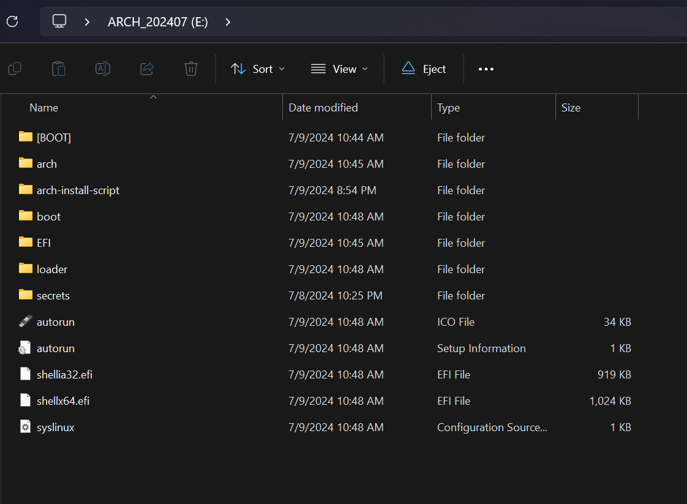
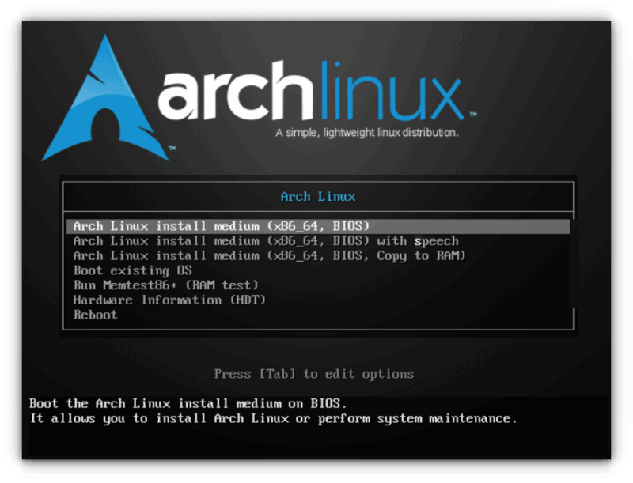
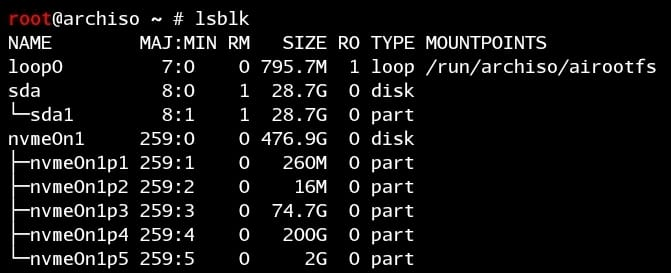
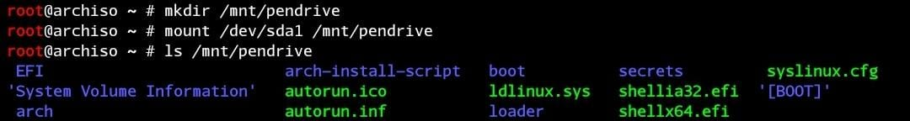
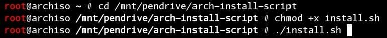
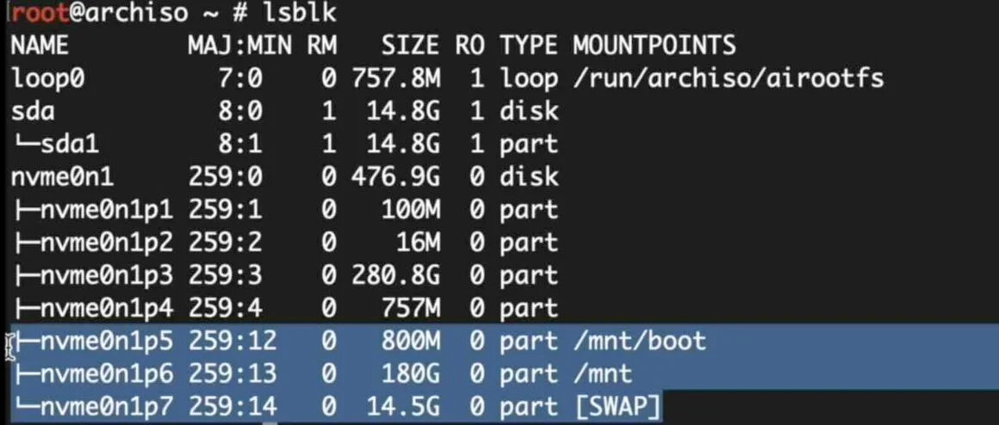
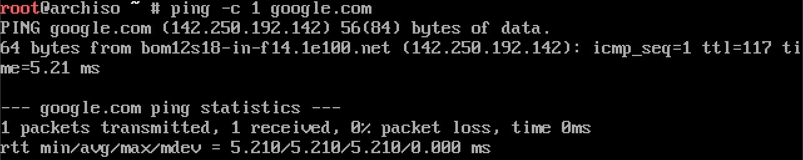

# Arch Linux Installation Script

## Overview

This script is meant to provide a starting point for users who have used some linux distros before like ubuntu, but never got around to using distros like arch which requires you to configure things on your own.

It can also be used to quickly setup an OS install.

## Pre-requisites

1. Creating a arch install boot loader.



2. Freeing up space

The minimum space required for the following types of installs is given below (feel free to free up more than that if you see fit):

- **Minimal (no desktop environment)**: 11 GB
- **GNOME or KDE Desktop Environment**: 41 GB
- **Wayland Desktop Enviornment**: 41 GB

Also do note that this does not include the swap partition size required (which is recommended to be the same size as your actual ram).

(swap space is optional but beneficial, enhancing system performance by providing additional virtual memory when RAM is full)

So if you have 8GB ram free up 41GB (for xfce/kde/wayland) + 8GB (for swap) = 49GB (or more)

## Installation

1. First clone the repository.

```
git clone https://github.com/JayeshNarkar/arch-install-script.git
```

2. Move the folder of the repo to your pendrive (which you have flashed arch installer iso on)

## How to run

1. Boot into the pendrive (where arch installer is loaded into)



2. List storage devices and identify the pendrive



```
lsblk
```

(in this case since my pendrive is 32 GBs, i can assume that the seperate sda partition of 28.7 GBs is it)

(remember that the pendrive will be in a seperate group/tree from the other partitions and will be only 1 partition for a device if you have not modified anything)

3. Mount the pendrive's partition to a folder



```
mkdir /mnt/pendrive
mount /dev/sda1 /mnt/pendrive
ls /mnt/pendrive
```

4. Change the directory the pendrive's and make the script executable



```
cd /mnt/pendrive/arch-install-script/
chmod +x install.sh
./install.sh
```

## Features

- User-Friendly.

- Interactive Execution: Step-by-step prompts for user control.

- Informative: Details on each step's actions and methods.

- Resumable: Picks up from the last completed step after exit.

## Logging

This script utilizes a log.txt file to keep track of how many steps have already been executed and how many are left. It is recommended that you do not change any contents of this file unnecessarily.

But if something goes wrong incase of error in previous step.

Feel free to delete the log file so that the script starts from first step again.

## Reference

How your partitions should look like after mounting and partioning:

```
lsblk
```



How to check for network connectivity:

```
ping -c 1 google.com
```



How to create the 3 partitions and give them types:

https://github.com/JayeshNarkar/arch-install-script/assets/141546762/9276cdaf-1fa8-4382-a524-7a9705c751e1

- Here the 800M partition is given type efi system, since boot/efi partition requires 500-800M

- The 8G partition is given type linux swap because thats the size of my ram on VM. And its type is given linux swap

- The rest of the free space is given to root and its type is correct by default for file system.
